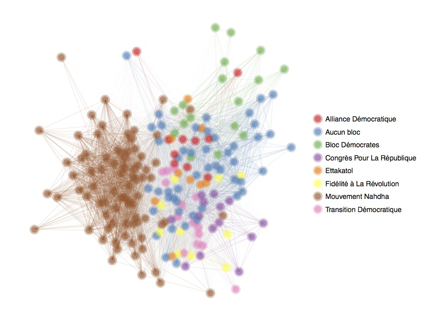
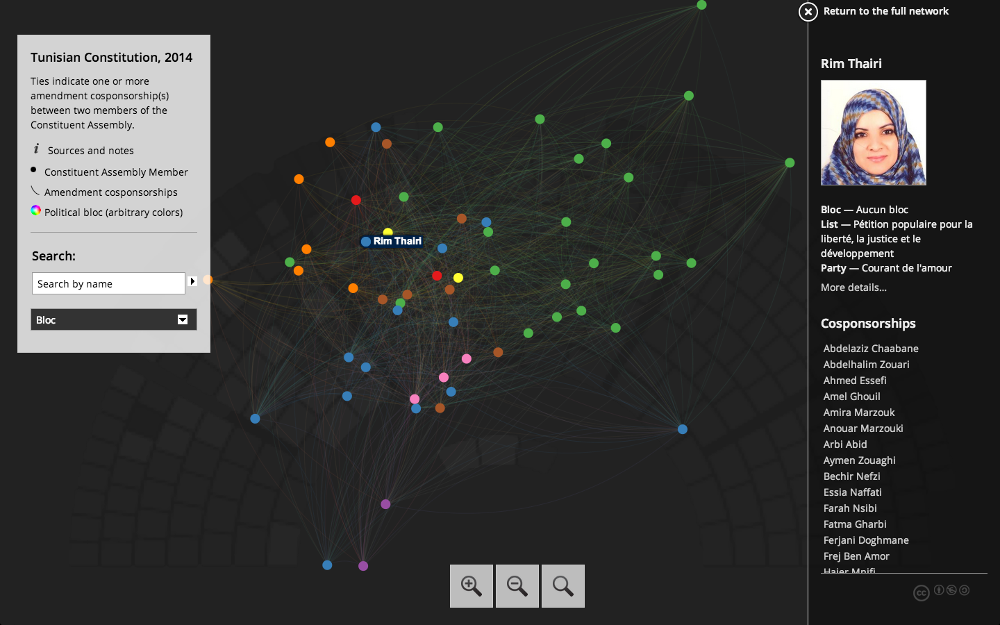
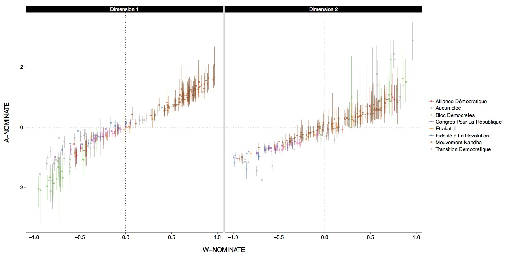

A scraper for [Marsad](http://www.marsad.tn) data that builds a network out of constitutional amendment cosponsorships:



> Colors are arbitrary.

The code also estimates legislator ideal points from their voting records: [see below](#alpha-NOMINATE).

## DEMO

[](http://briatte.org/marsad/)

> Click image to view.

## HOWTO

The main entry point is `make.r`, which will

1. collect MP and constitutional amendment data from Marsad.tn
2. build an undirected network from amendment cosponsorship
3. model the extent of political bloc homophily in the network
4. collect MP votes and estimate [alpha-NOMINATE](http://cran.r-project.org/web/packages/anominate/) ideal points

> __Note:__ the `data.r`, `ergm.r` and `gexf.r` scripts can be set to run on a subset of the amendments data: adjust the `sample` to run on a specific segment of the Constitution (either `"Préambule"` or `"ch1"` to `"ch7"`). Each script defaults to `FALSE` to run on the complete network.

## SPECS

### ERGM

The network model is parametered [as follows](https://github.com/briatte/marsad/blob/master/ergm.r#L4-L10):

```{S}
ergm(net ~ edges +
         gwdegree(decay = 1, fixed = TRUE) +
         nodefactor("bloc") +
         nodematch("bloc", diff = TRUE) + 
         nodefactor("sexe") +
         nodematch("sexe"),
       control = control.ergm(MCMLE.maxit = 100))
```

### alpha-NOMINATE

The ideal points are estimated [as follows](https://github.com/briatte/marsad/blob/master/vote.r#L152-L153):

```{S}
anominate(RC, dims = 2, polarity = 1, nsamp = 1000, thin = 1,
          burnin = 500, random.starts = FALSE, verbose = TRUE)
```

Here are results on two dimensions, compared to W-NOMINATE scores:



## TODO

* fix invalid birth year values
* add diagnostics to ERGM
* add [electoral law](http://www.marsad.tn/fr/loi_electorale/index) amendments
