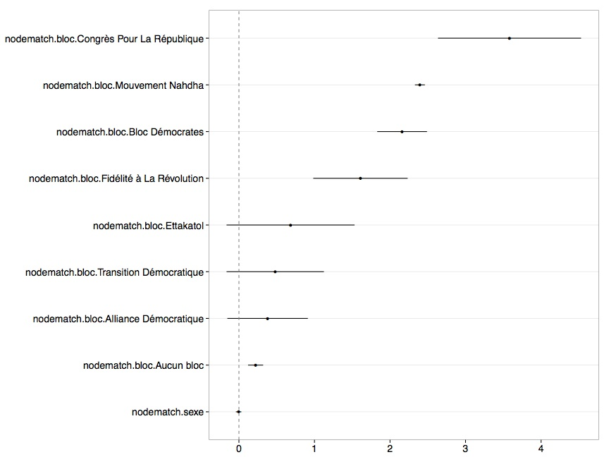

A scraper for [Marsad](http://www.marsad.tn) data that builds a network out of constitutional amendment cosponsorships:


> Colors are arbitrary.

Differential homophily [estimates](http://cran.r-project.org/web/packages/ergm/) of political bloc cohesion, controlling for network size, bloc size and degree:



> Parametered [as follows](https://github.com/briatte/marsad/blob/master/marsad.r#L255-L261):

```{S}
ergm(net ~ edges +
         gwdegree(decay = 1, fixed = TRUE) +
         nodefactor("bloc") +
         nodematch("bloc", diff = TRUE) + 
         nodefactor("sexe") +
         nodematch("sexe"),
       control = control.ergm(MCMLE.maxit = 100))
```

## TODO

* fix birth year variable
* add diagnostics to ERGM
