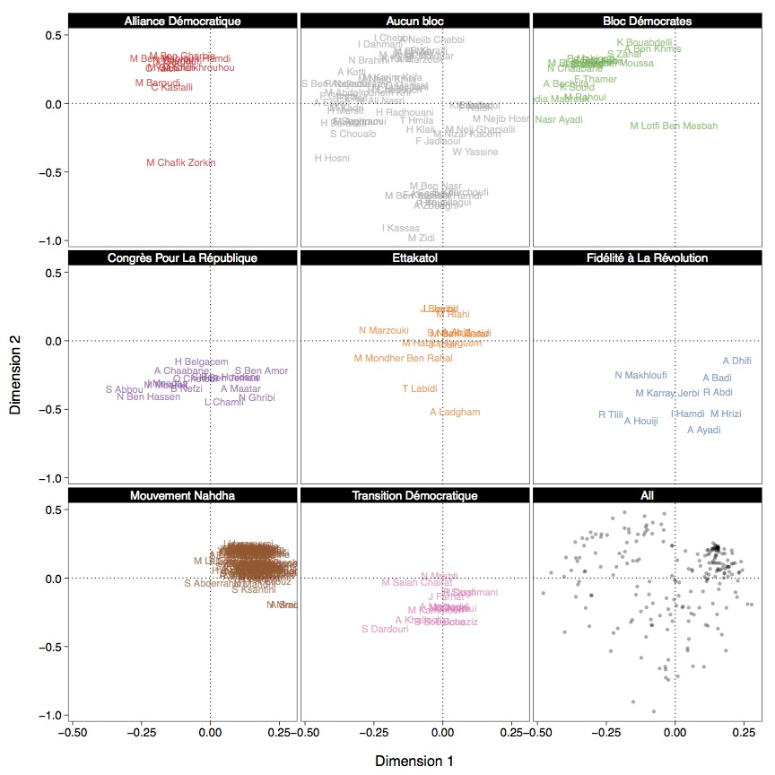

A scraper for [Marsad](http://www.marsad.tn) data that

* builds networks out of constitutional and electoral law amendments
* estimates legislator ideal points from their voting records

## DEMO

Click to view the amendment cosponsorship network of the entire Constitution:

[](http://briatte.org/marsad/)

> Based on data up to July 12, 2014.

## HOWTO

The main entry point is `make.r`, which will

1. collect MP and amendment data from Marsad.tn
2. build undirected cosponsorship networks
3. model the extent of political bloc homophily
4. collect MP votes to estimate [alpha-NOMINATE](http://cran.r-project.org/web/packages/anominate/) and [OC](http://cran.r-project.org/web/packages/oc/) ideal points

> __Note:__ the `data.r`, `ergm.r` and `gexf.r` scripts can be set to run on a subset of the Constitution amendments data: adjust the `sample` to run on a specific segment of the Constitution (either `"Préambule"` or `"ch1"` to `"ch7"`). Each script defaults to `FALSE` to run on the complete network. Electoral law data are collected and estimated separately by `elec.r`.

## SPECS

### ERGM

The network model is parametered [as follows](https://github.com/briatte/marsad/blob/master/code/ergm.r#L21-L27):

```{S}
ergm(net ~ edges +
         gwdegree(decay = 1, fixed = TRUE) +
         nodefactor("bloc") +
         nodematch("bloc", diff = TRUE) + 
         nodefactor("sexe") +
         nodematch("sexe"),
       control = control.ergm(MCMLE.maxit = 100))
```

### NOMINATE

The ideal points are estimated [as follows](https://github.com/briatte/marsad/blob/master/code/vote.r#L221-L222):

```{S}
anominate(RC, dims = 2, polarity = c(1, 1), nsamp = 1000, thin = 1,
          burnin = 500, random.starts = FALSE, verbose = TRUE)
```

In the two-dimensional model, all but 2 Nahdha members (_n_ = 87) score above 0 on the first dimension, and all but 12 non-Nahdha members (_n_ = 130) score below 0 on that same dimension:


> The range around the first dimension estimate is a 95% credible interval. The lighter dots mark the second dimension estimate.

Similarly, a two-dimensional [optimal classification][oc] assigns 83 out of 87 Nahdha members and 5 out of 130 non-Nahdha members to the same (top-right) quadrant:



[oc]: https://github.com/briatte/marsad/blob/master/code/vote.r#L194

## TODO

- [ ] add birth year values
- [ ] add diagnostics to ERGM
- [x] add [electoral law](http://www.marsad.tn/fr/loi_electorale/index) amendments
- [x] add [votes](http://www.marsad.tn/fr/votes) and ideal points
