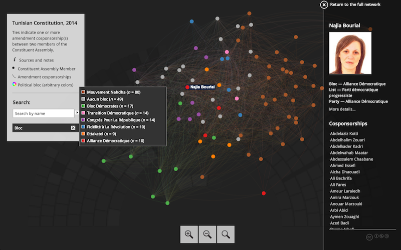

A scraper for [Marsad](http://www.marsad.tn) data that

* builds networks out of constitutional and electoral law amendments
* estimates legislator ideal points from their voting records

## DEMO

Click to view the Constitution amendment cosponsorship network:

## HOWTO

The main entry point is `make.r`, which will

1. collect MP and amendment data from Marsad.tn
2. build undirected cosponsorship networks
3. model the extent of political bloc homophily
4. collect MP votes to estimate ideal points

## TODO

- [x] add [electoral law](http://www.marsad.tn/fr/loi_electorale/index) amendments
- [x] add [votes](http://www.marsad.tn/fr/votes) and ideal points
- [x] fix birth year values
